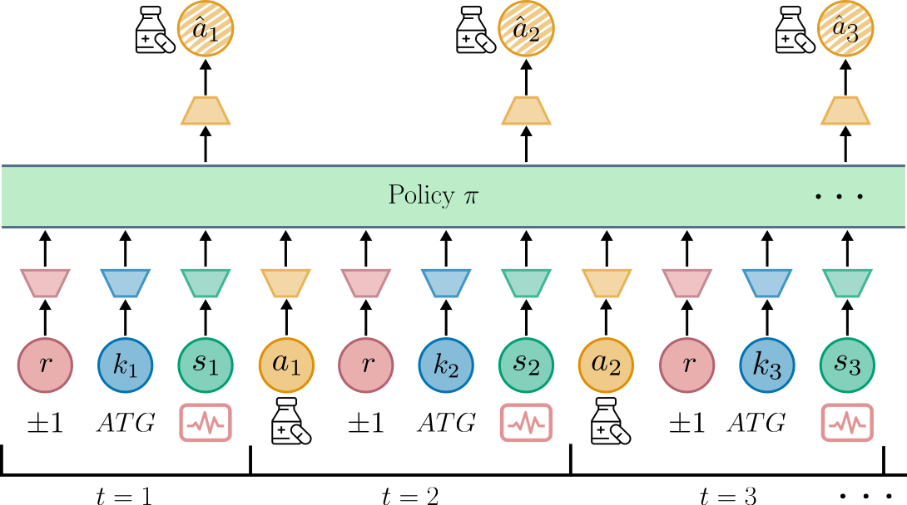
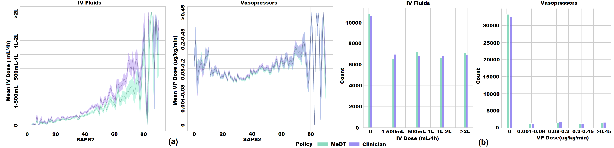

# Empowering Clinicians with MeDT: A Framework for Sepsis Treatment

## Overview

<p align="justify">
Sepsis is the leading cause of mortality in intensive care units, posing a significant challenge to healthcare professionals due to its rapid progression. Although deep reinforcement learning has shown promise in clinical decision support for sepsis, its applications have been limited by the need for interpretability and interactivity for clinicians. Further, these methods often fail to consider the full context of a patient’s medical history, making it difficult to assign credit to intermediate decisions and resulting in unstable training. To address these challenges,
we propose Medical Decision Transformer (MeDT), a novel offline reinforcement learning framework for sepsis treatment recommendation. MeDT is based on the decision transformer architecture, and conditions the model on rewards based on treatment outcomes, hindsight patient acuity scores, past dosages and the patient’s current and past medical state at every timestep, thereby considering the full context of a patient’s medical history, enabling more informed decision-making. We also introduce a mechanism for estimating the clinical state of patients based on
chosen medical interventions, using a causal transformer model, allowing improved estimation of patient stability scores. Using data from the MIMIC-III dataset, we demonstrate that MeDT produces interventions that improve patient stability, in addition to effective behaviour cloning. Our results and analysis of the proposed approach highlight its potential to be both interactable and interpretable by clinicians, providing a foundation for developing more effective sepsis treatment strategies.</p>

<br>
<center>


<br>
<p align="center">

</p>

<h4 align="justify"><i>Figure 1. </i>MeDT training: At each time-step t, the MeDT policy attends to past treatment trajectory. This includes the desired treatment outcome r (at inference time fixed to +1 for survival), desired next-step acuities k<sub>1</sub>,..., k<sub>t</sub>, patient states s<sub>1</sub>,...,s<sub>t</sub>, administered drug doses a<sub>1</sub>,...,a<sub>t-1</sub>, and outputs a prediction a&#770<sub>t</sub> of dose a<sub>t</sub>.</h4>

<br>
<p align="center">

</p>

<h4 align="justify"><i>Figure 2. </i>(a) Dosage suggested by MeDT and clinician policy for different SAPS2 scores. (b) Distribution of IV fluids and VPs given by the MeDT and clinician policies.
</center>


## Installing the environment

    # Install Python 3.7.9 if necessary
    $ pyenv install 3.7.9
    $ pyenv shell 3.7.9
    
    $ python --version
    Python 3.7.9
    
    $ python -m venv env
    $ source env/bin/activate
    $ pip install -r requirements.txt


## Usage of Repo
The `scripts` folder contains the files to reproduce the results in the paper.

## Data

The data used to run experiments is extracted from the [MIMIC-III dataset](https://physionet.org/content/mimiciii/1.4/), based on the septic patient cohort defined by Komorowski et al (2018). We utilize the data extracted and preprocessed codes as defined in the repository by [Killian et al.](https://github.com/MLforHealth/rl_representations). Follow the steps in that repository to generate the files 'train_set_tuples', 'val_set_tuples' and 'test_set_tuples' and place these files into the `data` folder. The train, validation and test splits are the same as that used by [Killian et al.](https://github.com/MLforHealth/rl_representations).


### Data preparation

```
python =scripts/prepare_data.py
```

## Run experiments

Following data preparation, you can start training and reproduce the results of the paper by following the steps below. The figures genereated in step two will be saved in the `logs` folder.


### 1. Train models
First, the policy network is trained for treatment dosage prediction. Then, we train an additional state-predictor to evaluate the learnt policies.
#### Train policy network
Select model_type as MeDT, DT or BC to train desired model.
```
python ./scripts/train_MeDT.py --model_type MeDT
```

#### Train state predictor
```
python ./scripts/train_SP.py
```

### 2. Evaluation and plotting

```
python ./scripts/evaluate_policy.py
```


## Acknowledgements

* The DT codebase is modified from [here](https://github.com/kzl/decision-transformer/tree/master/atari/mingpt).